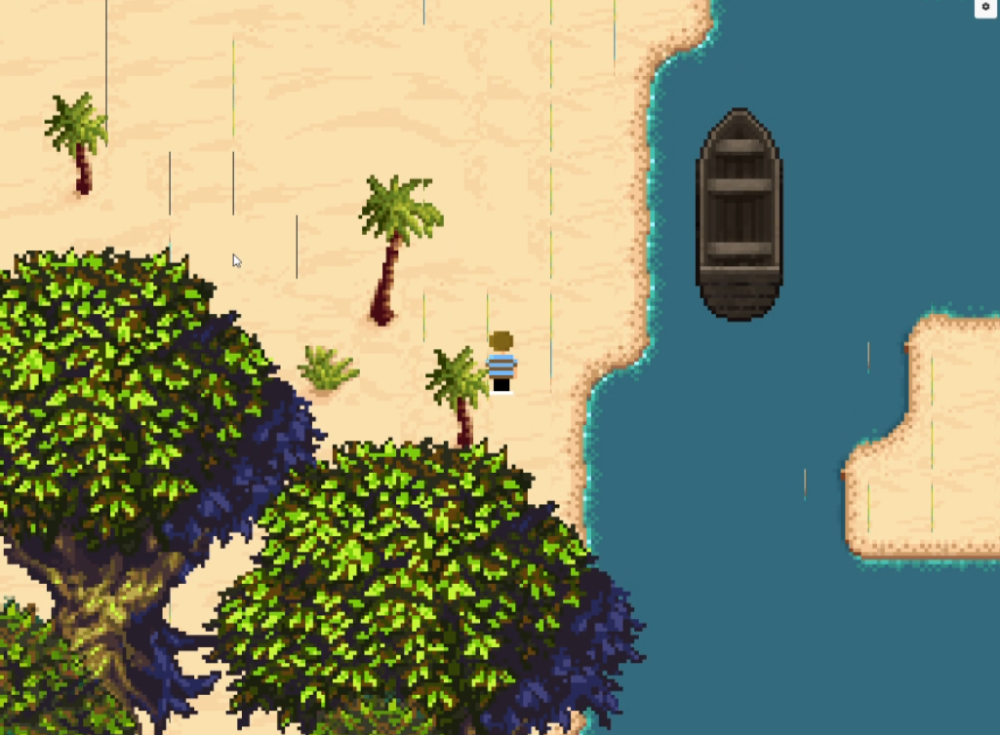
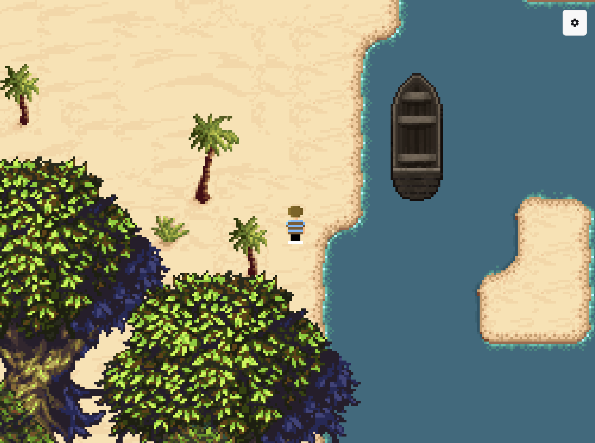
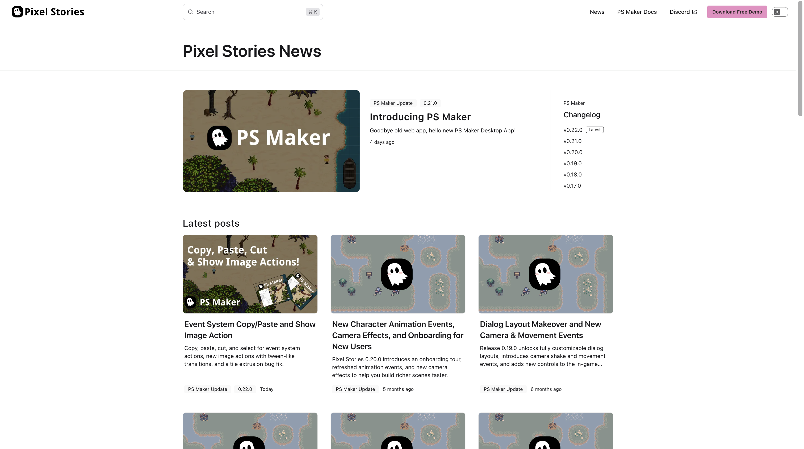

import Video from "../../../components/Video.astro";
import copyPaste from "./copy-paste.mp4";
import imageAction from "./image-action.mp4";

## Event System Copy, Paste, Cut, and Select

Hey everyone, in this update I'm adding some common operations that are extremely useful for event system actions.

The problem with the event system right now is that once you add a number of actions to an event, there's no easy way to move them around. Say for example you wanted to move your actions from one event to another. You would have to add each of those actions individually to the new place and then remove them all from the old place... Just a huge painful process if you wanted to edit your story.

So the solution is basically treating actions as items that you can select and copy paste to move them around. This copies the action and all of its properties and configuration, then pastes it exactly into another spot. Right now it doesn't do anything intelligent like detecting whether an NPC that you spawned earlier still exists at the new spot. If the NPC doesn't exist anymore then the action simply won't work, so you'll have to watch out for that yourself.

<Video src={copyPaste} />

## Show Image Actions

Along with this update, I'm also adding new image actions. They are the following:

- Show image
- Set image properties
- Remove image

What's cool about these image actions is that you can show an image, then set the properties on that image with a transition, so it acts like a tween effect.

<Video src={imageAction} />

## Fixed Tile Extrusion Bug

There was a bug where tilesets had the classic 2D rendering pixel art line bleeding. This was fixed by adding tile extrusion to the tileset pipeline. So that's nice!

| Before                                 | After                                  |
| -------------------------------------- | -------------------------------------- |
|  |  |

See changelog for [PS Maker v0.22.0](/changelog#0220).

## Website Blog Page Refresh!

In addition to the PS Maker updates, I also refreshed the website's blog page UI/design! A well needed breath of fresh air to the old and ugly page from before.

Thank you everyone for the continued support!
