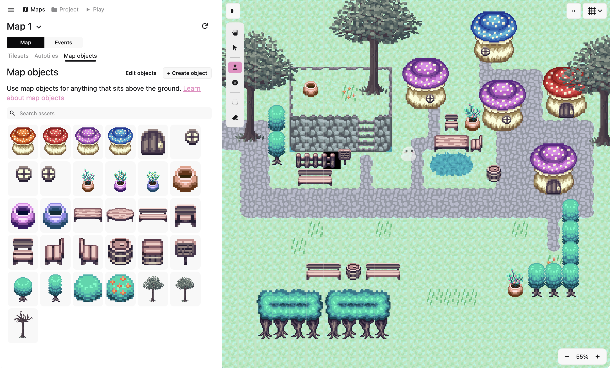
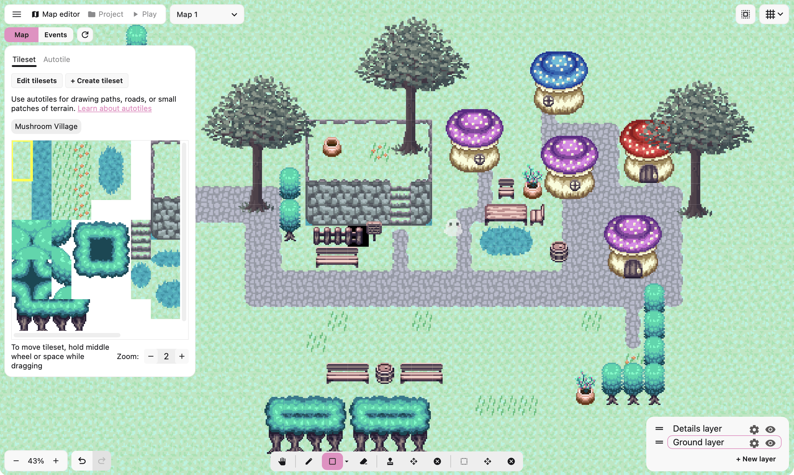

Hey guys. This update introduces a map editor overhaul, which reomves the side panel entirely and replaces it with individual panels that conditionally show or are hidden based on the context of what you're doing.

I usually don't like making big UI changes unless it solves a specific problem. The problem here was that two things were fighting over what the side panel showed you: the tool you had selected and the tabs in the side panel. So you could switch to the draw tile tool (which shows the tileset), but then click over to the map objects tile. The map tool would then switch to placing map objects. It was overall clunky and confusing.

The simplest fix would've been to just remove the tabs and let the tools fully dictate what's shown. But some tools don't have anything to show in the side panel, which means it would be empty and just take a lot of wasted white space. Instead, I replaced the side panel entirely with individual panels that show or hide based on what tool you're using.

**Map editor before**

**Map editor after (much better!!)**

I think this was the best solution to the problem, and it also visually looks nicer because it gives you more area to look at your map. Instead of the side panel taking up a whole quarter of your screen, now the game canvas takes up the entire screen and everything else is on top of it. I think it looks better and it's a really nice upgrade, but let me know what you guys think! You can always find me in the [Pixel Stories Discord](https://discord.gg/WTxUC4hEnS)!!

See changelog for [PS Maker v0.24.0](/changelog#0240).
