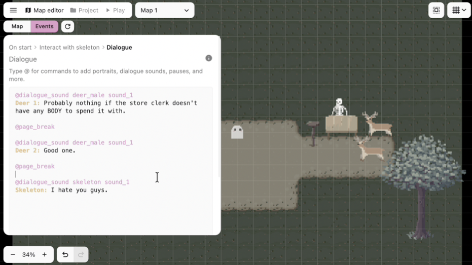

Hey everyone, in this update I'm releasing dialogue sounds!

One of the coolest parts about story-driven games is how characters can have unique personalities. One thing that contributes to those personalities the most is the dialogue sounds that plays when a specific character talks. Think Sans from Undertale versus Papyrus. They have completely different voices, and the whole game just would not feel the same if those iconic voices didn't exist.

Along with the release, I also made a video showcasing the dialogue sounds feature, including a timelapse of how I made the scene for it!

<iframe
  width="100%"
  height="315"
src="https://www.youtube.com/embed/z9p6HcQH9gA?si=LmFJjmdhiG8W3Q5_"   title="Dialogue sounds showcase video"
  frameBorder="0"
  allow="accelerometer; autoplay; clipboard-write; encrypted-media; gyroscope; picture-in-picture; web-share"
  referrerPolicy="strict-origin-when-cross-origin"
  allowFullScreen
/>

That's why today I'm releasing dialogue sounds, which is a way in PS Maker to easily add voices to your dialogue.

The way it works is by creating a dialogue sound profile within an NPC or a dialogue layout. You can add multiple audio files to a sound pool, and then PS Maker will pick from that pool while the text is typing out. This makes it easy to give each character their own voice without needing to manually place a sound effect on every single letter or line of dialogue.

To use a dialogue sound, you add the `@dialogue_sound` command to your dialogue action to specify which dialogue sound should play. That means you can set a default sound on an NPC, override it through a layout, and still change the active sound inside the actual dialogue when you need to. So if a character has a normal voice, a nervous voice, or a creepy voice for one specific moment, you can swap to the right sound directly in the action.

Along with dialogue sounds, I also cleaned up some of the default dialogue and choices layout config so text sizes feel more reasonable out of the box. There was also a small screen bug where the dialogue box could look inconsistent because of hard coded pixel padding, which is fixed now too.

There are also a bunch of event system improvements in this release. The map editor preview now shows the current map state up to and including the action you're on, instead of stopping right before it. Action lists should also feel nicer to work with now, especially when dragging to select actions or dragging to reorder them. I also fixed not being able to deselect actions, animation select lists overflowing on small screens, and a bug where being inside an action in the event tab could block you from clicking back to the map editor tab.

I think dialogue sounds make a huge difference for story-driven games. Characters feel a lot more alive when they have their own voice, and I'm excited to see what people do with it. Let me know what you guys think! You can always find me in the [Pixel Stories Discord](https://discord.gg/WTxUC4hEnS)!

See changelog for [PS Maker v0.25.0](/changelog#0250).
