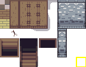

Tilesets are the backbone of your maps. They provide the basic terrain: grass, dirt, water, walls, and other repeating pieces that form the world. By combining tilesets with [autotiles](../autotiling/), you can build environments that feel alive and consistent.

## What Is a Tileset

A tileset is an image that contains many smaller tiles. Each tile is like a puzzle piece. When you place them together, they form the ground, walls, or paths of your map.

## Adding Tilesets

There are two main ways to add tilesets into your project:

- Use the **Create Tileset** button to make a new one.
- Import from the **Asset Library**, which has open source assets already converted into PS Maker format.

## Selecting and Placing Tiles

- Click on a tile to select it.
- Drag to select multiple tiles at once.
- Place them on your map with the toolbar tools.

You can draw single tiles or larger shapes such as rectangles and circles. Use the erase tool to erase tiles.

## Map Tiling Layers

When you draw tiles, they go into a layer in the map. You can edit layers in the bottom left of the game window. Make sure the correct active layer is selected for drawing.

You have full control of the layer setup in your game. By default, PS Maker has the following layers:

- **Details Layer**: For details like small plants, flowers, or adding variety to ground tiles.
- **Ground Layer**: For main terrain, walking surfaces, floors, and walls.

## Updating a Tileset

If you ever expand or edit your tileset image, you can simply replace the file in PS Maker. The map will keep working as long as you expand the image downward or to the right. This way, your old tiles keep their positions correctly.
